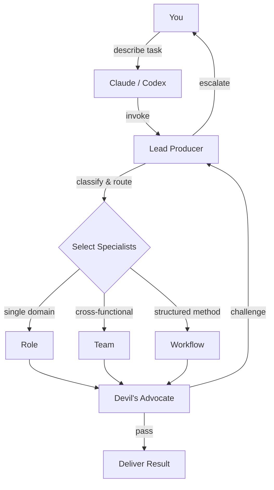

# Lead Producer - Game Development Skill Pack

**Catch economy exploits, balance breaks, and smart contract bugs before they ship.** One entry
point - the Lead Producer assembles the right specialists, stress-tests the result, and gives you
a synthesized action plan.

46 AI skills: 28 specialist roles, 12 review teams, 5 structured workflows. Works with
**Claude Code** and **OpenAI Codex** on Mac and Windows.

---

## What It Looks Like

**Claude Code request**

```text
/lead-producer Review my crafting economy for exploits. Players craft items
from gathered resources and sell on the marketplace.
```

**Codex request**

```text
Use $lead-producer to review my crafting economy for exploits. Players craft
items from gathered resources and sell on the marketplace.
```

**Lead Producer routes to:** Red Team (adversarial) + Economy Team (structural)

**Output**

```text
LEAD PRODUCER REPORT
====================
Routing: Red Team (exploit surface) + Economy Team (faucet/sink balance)
Overlays: None required - no product-specific context loaded

FINDINGS (synthesized):

1. CRITICAL - Infinite craft loop: If crafting output is tradeable AND
   disassembly returns inputs, players can cycle items through alts to
   generate net-positive materials. Exploit requires only 2 accounts.
   Fix: disassembly returns 60-80% of inputs (configurable sink).

2. HIGH - Marketplace price floor bypass: Rare materials have no minimum
   listing price. Attackers can list at 1 currency to manipulate price
   oracles downstream. Fix: enforce floor at crafting-cost basis.

3. MEDIUM - Gathering bot profitability: Resource nodes respawn on fixed
   timers. Bot ROI is positive above 3 nodes/minute. Fix: randomize
   respawn windows +/-30% and add diminishing returns per-account.
```

This is what 46 specialists working together looks like: one prompt, structured analysis, and a
prioritized action plan.

---

## Why This Exists

AI coding assistants are generalists. They will often give you surface-level feedback on economy
design, miss non-obvious exploit chains, and skip the step where their own recommendations get
stress-tested.

This pack replaces "ask an assistant and hope" with a structured review process: domain specialists
analyze the problem, a Devil's Advocate challenges their assumptions, and the Lead Producer
synthesizes everything into an actionable result with evidence standards and severity rankings.

You do not need to know the internal routing. Describe the problem. The Lead Producer figures out
who to call.

---

## Quick Start

### Claude Code

```bash
git clone https://github.com/saemihemma/lead-producer.git
cd lead-producer
ln -s "$(pwd)/.claude" /path/to/your/project/.claude
```

Start a session in your project directory, then use `/lead-producer`.

### OpenAI Codex

```bash
git clone https://github.com/saemihemma/lead-producer.git && cd lead-producer
./scripts/install-codex.sh
```

```powershell
git clone https://github.com/saemihemma/lead-producer.git
Set-Location lead-producer
.\scripts\install-codex.ps1
```

Restart Codex, then use `$lead-producer`. Example:

```text
Use $lead-producer to review this feature for security risks.
```

See [`.codex/INSTALL.md`](.codex/INSTALL.md) for the Codex install details.

---

## What's Inside

### 28 Specialist Roles

| Domain | Roles |
|--------|-------|
| Economy and Balance | Economy Designer, Economist, Behavioral Economist, Game Balance Designer |
| Game Design | Game Designer, Product Manager, Technical Product Manager |
| Engineering | Backend, Frontend, Principal Software, Software Architect, Scalability |
| Smart Contracts | Move/Sui Developer |
| Security and QA | Security Engineer, QA Engineer |
| Infrastructure | DevOps, Railway Deployment, LiveOps Engineer |
| Data | Analytics Engineer, Data Engineer |
| Leadership | CTO, Context Manager |
| Brand and Community | Brand Strategist, Community Developer, UI/UX Designer |
| Documentation | Technical Writer, Open Source Engineer, Code Reduction Engineer |

### 12 Review Teams

| Team | What It Does |
|------|--------------|
| Red Team | Adversarial review - exploits, economic abuse, scalability attacks |
| Dev Team | Code review - correctness, patterns, maintainability |
| Architecture Review | Structural decisions - trade-offs, migration, technical debt |
| Economy Team | Economy health - token flows, inflation, marketplace balance |
| Product Team | Feature evaluation - player value, scope, priority |
| Frontend Team | UI implementation - components, accessibility, performance |
| Move Team | Smart contract review - on-chain safety, gas, upgrade paths |
| Infrastructure | Deployment - CI/CD, monitoring, cost, scaling |
| Brand Team | Brand consistency - voice, visual system, naming |
| Documentation | Docs quality - accuracy, completeness, maintainability |
| Blue Team | Cleanup verification - dead code removal, regression check |
| Open Source | OSS readiness - licensing, contribution guides, API surface |

### 5 Workflows

| Workflow | When To Use |
|----------|-------------|
| Incident Response | Production is broken. Detect -> triage -> act -> postmortem |
| Issue Triage | Structured bug investigation and root-cause analysis |
| Test-Driven Development | Behavior-sensitive changes need disciplined execution |
| Design Interface Options | Compare 3 interface approaches side-by-side |
| shadcn/ui Implementation | Component implementation with shadcn/ui patterns |

---

## How It Works



The flow is simple: you describe a task, Lead Producer classifies it and picks the minimum viable
team, specialists analyze it, Devil's Advocate stress-tests the result, and you get a consolidated
report. If the team cannot resolve a disagreement, Lead Producer escalates with both positions
documented.

---

## More Examples

### Production incident

**Claude Code**

```text
/lead-producer Production is down - players can't mint
```

**Codex**

```text
Use $lead-producer to respond to a production incident: players can't mint.
```

### When specialists disagree

**Claude Code**

```text
/lead-producer Can we add PvP loot drops without breaking the economy?
```

**Codex**

```text
Use $lead-producer to assess whether PvP loot drops would break the economy.
```

### UI design comparison

**Claude Code**

```text
/lead-producer Design three options for guild management UI
```

**Codex**

```text
Use $lead-producer to design three options for guild management UI.
```

---

## Context Overlays

This is a generic game development pack with zero product-specific knowledge.

If your game needs project-specific context, create a separate context module pack and map it to
the generic roles through a coordinator. The Lead Producer can then load those modules only when
they are explicitly named or routed in.

---

## Architecture

```text
lead-producer/
|-- .claude/                          # source of truth
|   |-- CLAUDE.md                     # routing table, loading rules, protocols
|   |-- settings.json                 # permission config
|   `-- skills/                       # 46 skill directories
|       |-- lead-producer/SKILL.md
|       |-- role-economist/SKILL.md
|       |-- team-red-team/SKILL.md
|       `-- ...
|-- .codex/
|   `-- INSTALL.md                    # Codex install guide
|-- scripts/
|   |-- install-codex.sh              # macOS/Linux Codex installer
|   `-- install-codex.ps1             # Windows Codex installer
|-- whenupdating.md                   # maintenance checklist
|-- README.md
|-- LICENSE
`-- .gitignore
```

`.claude/skills/` is the single canonical source. Claude Code reads it directly. Codex links to it
via the install scripts. One source, two runtimes.

Skills load lazily: `CLAUDE.md` provides the routing rules, and individual skills load only when
the Lead Producer explicitly names them.

---

## Customization

**Add a role:** Create `.claude/skills/role-your-role/SKILL.md` with:

```yaml
---
name: role-your-role
description: "What this role does in one line"
---
```

Then add the routing entry to `.claude/CLAUDE.md`.

**Add a team:** Same structure, plus `context: fork` in frontmatter. Add `effort: high` if the
team has 5+ members or handles a high-risk domain.

**Create a context overlay:** Create a separate pack with its own coordinator that maps the overlay
modules to the generic roles in this pack.

---

## License

Internal use. Adjust before open-sourcing.
