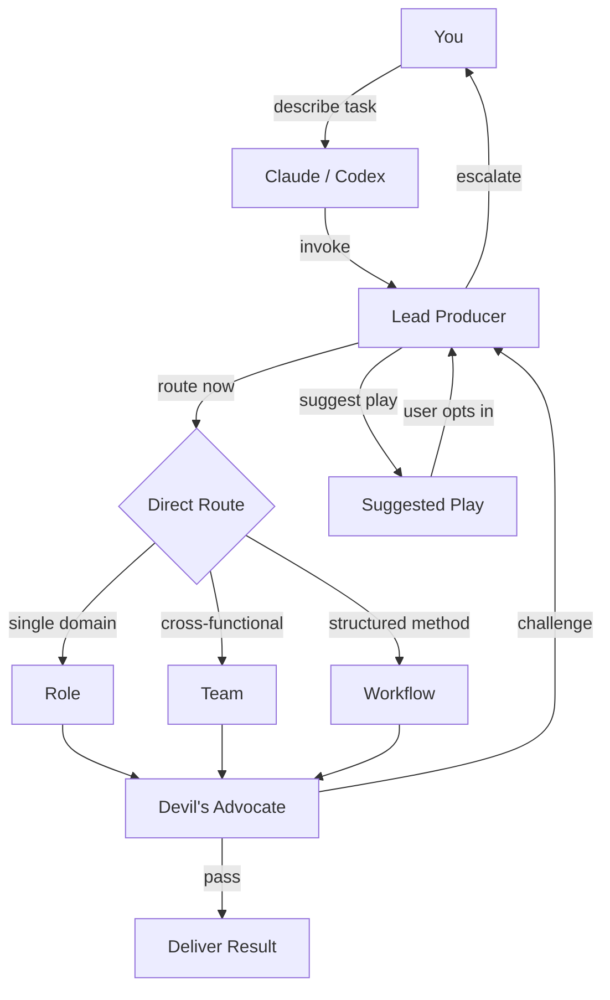

# Lead Producer - Full-Stack AI Product Team

**AI agent work is probabilistic.** Better guardrails, sharper routing, stronger architecture, and
more diverse perspectives on the same problem all increase the odds of a good outcome. Lead
Producer is built to make that reliability practical: one entry point, the right specialists,
explicit stress-testing, and clear recommendations instead of scattered guesses.

This pack models agent work after real software professions because those structures improve
decision quality. Roles, teams, and workflows give agents boundaries, accountability, and multiple
angles on design, frontend, backend, product, QA, smart contracts, deployment, live ops,
iteration, and cleanup.

Complex games that run from conception to live service are one of the hardest environments in
software development. MMO-scale work punishes weak context and bad coordination, whether the team
is human or agentic. That is why this library is tuned to stay lean on context and efficient on
routing so agents can spend more attention on the development itself: economies, progression,
exploits, incidents, rollout risk, and tightly coupled systems. If it can handle that, it becomes
broadly useful across other software work too.

50 AI skills: 28 specialist roles, 12 review teams, 9 structured workflows. Use it across the
full product lifecycle: prototype, design, implementation, testing, deployment, live ops,
iteration, and code cleanup. Works with **Claude Code** and **OpenAI Codex** on Mac and Windows.

---

## What It Looks Like

**Claude Code request**

```text
/lead-producer Review my crafting economy for exploits. Players craft items
from gathered resources and sell on the marketplace.
```

**Codex request**

```text
Use $lead-producer to review my crafting economy for exploits. Players craft
items from gathered resources and sell on the marketplace.
```

**Lead Producer routes to:** Red Team (adversarial) + Economy Team (structural)

**Output**

```text
LEAD PRODUCER REPORT
====================
Route Now: team-red-team, team-economy-team
Suggested Play: none
Route Rationale: Red Team (exploit surface) + Economy Team (faucet/sink balance)
Overlays: None required - no product-specific context loaded

FINDINGS (synthesized):

1. CRITICAL - Infinite craft loop: If crafting output is tradeable AND
   disassembly returns inputs, players can cycle items through alts to
   generate net-positive materials. Exploit requires only 2 accounts.
   Fix: disassembly returns 60-80% of inputs (configurable sink).

2. HIGH - Marketplace price floor bypass: Rare materials have no minimum
   listing price. Attackers can list at 1 currency to manipulate price
   oracles downstream. Fix: enforce floor at crafting-cost basis.

3. MEDIUM - Gathering bot profitability: Resource nodes respawn on fixed
   timers. Bot ROI is positive above 3 nodes/minute. Fix: randomize
   respawn windows +/-30% and add diminishing returns per-account.
```

This is what a coordinated AI skill pack looks like: one prompt, structured analysis, and a
prioritized action plan.

---

## Why This Exists

AI coding assistants are generalists. They will often give you surface-level feedback on economy
design, miss non-obvious exploit chains, and skip the step where their own recommendations get
stress-tested.

This pack replaces "ask an assistant and hope" with a structured review process: domain specialists
analyze the problem, a Devil's Advocate challenges their assumptions, and the Lead Producer
synthesizes everything into an actionable result with evidence standards and severity rankings.
The point is not bigger prompts. It is to make agents behave more like decision systems: surface
evidence, compare trade-offs, state confidence, and make the next step obvious.

It also comes from synthesis, not reinvention. This pack draws inspiration from `superpowers`,
`compilation7`, `gstack`, and Claude Code Game Studios, then adapts those ideas into a coordinated
system for end-to-end MMO and live-service development. It is not a direct fork or bundled
dependency on any of them.

You do not need to know the internal routing. Describe the problem. The Lead Producer figures out
who to call, or whether to suggest a deeper play before routing.

That only works if the pack stays lean. It loads only the roles, teams, and workflows a task
actually needs so the model keeps its context window for the work itself instead of burning it on
unused guidance. Less prompt bloat means better focus and fewer hallucinations from irrelevant
instructions.

---

## Quick Start

### Claude Code

```bash
git clone https://github.com/saemihemma/lead-producer.git
cd lead-producer
ln -s "$(pwd)/.claude" /path/to/your/project/.claude
```

Start a session in your project directory, then use `/lead-producer`.

### OpenAI Codex

```bash
git clone https://github.com/saemihemma/lead-producer.git && cd lead-producer
./scripts/install-codex.sh
```

```powershell
git clone https://github.com/saemihemma/lead-producer.git
Set-Location lead-producer
.\scripts\install-codex.ps1
```

Restart Codex, then use `$lead-producer`. Example:

```text
Use $lead-producer to investigate why reward claims intermittently fail after reconnect. Find the root cause before fixing.
```

See [`.codex/INSTALL.md`](.codex/INSTALL.md) for the Codex install details.

---

## What's Inside

### 28 Specialist Roles

| Domain | Roles |
|--------|-------|
| Economy and Balance | Economy Designer, Economist, Behavioral Economist, Game Balance Designer |
| Game Design | Game Designer, Product Manager, Technical Product Manager |
| Engineering | Backend, Frontend, Principal Software, Software Architect, Scalability |
| Smart Contracts | Move/Sui Developer |
| Security and QA | Security Engineer, QA Engineer |
| Infrastructure | DevOps, Railway Deployment, LiveOps Engineer |
| Data | Analytics Engineer, Data Engineer |
| Leadership | CTO, Context Manager |
| Brand and Community | Brand Strategist, Community Developer, UI/UX Designer |
| Documentation | Technical Writer, Open Source Engineer, Code Reduction Engineer |

### 12 Review Teams

| Team | What It Does |
|------|--------------|
| Red Team | Adversarial review - exploits, economic abuse, scalability attacks |
| Dev Team | Code review - correctness, patterns, maintainability |
| Architecture Review | Structural decisions - trade-offs, migration, technical debt |
| Economy Team | Economy health - token flows, inflation, marketplace balance |
| Product Team | Feature evaluation - player value, scope, priority |
| Frontend Team | UI implementation - components, accessibility, performance |
| Move Team | Smart contract review - on-chain safety, gas, upgrade paths |
| Infrastructure | Deployment - CI/CD, monitoring, cost, scaling |
| Brand Team | Brand consistency - voice, visual system, naming |
| Documentation | Docs quality - accuracy, completeness, maintainability |
| Blue Team | Cleanup verification - dead code removal, regression check |
| Open Source | OSS readiness - licensing, contribution guides, API surface |

### 9 Workflows

| Workflow | When To Use |
|----------|-------------|
| Project Discovery | Inherited repos, broad unknowns, or "understand this first" situations |
| Current State Capture | Bounded subsystem orientation, current-reality understanding, and newcomer handoff |
| Specialist Hardening | Repeated 3-reviewer rounds for high-stakes or hard-to-reverse work |
| Incident Response | Production is broken. Detect -> triage -> act -> postmortem |
| Systematic Debugging | Unknown bug or failure. Reproduce -> hypothesize -> test -> confirm root cause |
| Issue Triage | Package debugging findings into a durable handoff artifact |
| Test-Driven Development | Behavior-sensitive changes need disciplined execution |
| Design Interface Options | Compare 3 interface approaches side-by-side |
| shadcn/ui Implementation | Component implementation with shadcn/ui patterns |

---

## How It Works



The flow is simple: you describe a task, Lead Producer either routes immediately or recommends a
suggested play first. If LP routes now, the selected specialists analyze the task and Devil's
Advocate stress-tests the substantive recommendation. If LP suggests a play, you opt in and LP
then routes there. If the team cannot resolve a disagreement, Lead Producer escalates with both
positions documented.

## LP-First Suggested Plays

Lead Producer is still the only documented entrypoint. When a task needs understanding before
judgment, LP can recommend a deeper workflow without auto-running it:

- `Suggested Play: workflow-project-discovery` for inherited repos, broad unknowns, or discovery-first work
- `Suggested Play: workflow-current-state-capture` for bounded "what exists now" understanding before you change something

A suggested play is a recommendation, not an automatic route. If you want it, reply to LP with
"use the project discovery play" or "help me understand the current state of this system," and LP
will route there immediately.

Legacy note: older "reverse documentation" phrasing still routes through LP to current-state
capture for compatibility.

Project discovery is repo-wide. Current-state capture is bounded to one system, flow, or artifact
cluster.

## Specialist Hardening

When the stakes are high or you explicitly want deeper pressure, LP can route directly to
`workflow-specialist-hardening`. That workflow runs 3 contextualized reviewer slots per round and
keeps going until the work clears the quality bar, needs a real user decision, or stops improving.
Use it after discovery or current-state capture when understanding exists and the remaining problem
is quality.

## Frontend Companion Tooling

For frontend-heavy work, strongly prefer Playwright or an equivalent real-browser loop when the
question depends on interaction bugs, responsive behavior, accessibility, browser state, or
network and error handling. This repo does not bundle Playwright; treat it as a companion tool
that makes frontend review and debugging more trustworthy.

---

## More Examples

### Production incident

**Claude Code**

```text
/lead-producer Production is down - players can't mint
```

**Codex**

```text
Use $lead-producer to respond to a production incident: players can't mint.
```

### When specialists disagree

**Claude Code**

```text
/lead-producer Can we add PvP loot drops without breaking the economy?
```

**Codex**

```text
Use $lead-producer to assess whether PvP loot drops would break the economy.
```

### UI design comparison

**Claude Code**

```text
/lead-producer Design three options for guild management UI
```

**Codex**

```text
Use $lead-producer to design three options for guild management UI.
```

### Unknown bug investigation

**Claude Code**

```text
/lead-producer Investigate why reward claims intermittently fail after reconnect. Find the root cause before fixing.
```

**Codex**

```text
Use $lead-producer to investigate why reward claims intermittently fail after reconnect. Find the root cause before fixing.
```

### Debugging handoff

**Codex**

```text
Use $lead-producer to package this debugging result into a handoff artifact for the next engineer.
```

### Discovery-first repo mapping

**Claude Code**

```text
/lead-producer This codebase is inherited and messy. Figure out whether we should do a focused architecture spike or a broader discovery pass first.
```

**Codex**

```text
Use $lead-producer to assess this inherited repo and suggest the right discovery play before implementation.
```

### Current-state capture for a new owner

**Claude Code**

```text
/lead-producer Help me understand the current state of the reward claim flow before we change it.
```

**Codex**

```text
Use $lead-producer to help me understand the current state of the reward claim flow before we change it.
```

### Specialist hardening

**Claude Code**

```text
/lead-producer This payout rollback plan is high stakes. Run the specialist hardening play and repeat until 9.
```

**Codex**

```text
Use $lead-producer to run the specialist hardening play on this launch-critical payout rollback plan. Repeat until 9.
```

---

## Context Overlays

This is a generic game development pack with zero product-specific knowledge.

If your game needs project-specific context, create a separate context module pack and map it to
the generic roles through a coordinator. The Lead Producer can then load those modules only when
they are explicitly named or routed in.

---

## Architecture

```text
lead-producer/
|-- .claude/                          # source of truth
|   |-- CLAUDE.md                     # routing table, loading rules, protocols
|   |-- settings.json                 # permission config
|   `-- skills/                       # skill directories
|       |-- lead-producer/SKILL.md
|       |-- role-economist/SKILL.md
|       |-- team-red-team/SKILL.md
|       `-- ...
|-- .codex/
|   `-- INSTALL.md                    # Codex install guide
|-- scripts/
|   |-- install-codex.sh              # macOS/Linux Codex installer
|   `-- install-codex.ps1             # Windows Codex installer
|-- whenupdating.md                   # maintenance checklist
|-- README.md
|-- LICENSE
`-- .gitignore
```

`.claude/skills/` is the single canonical source. Claude Code reads it directly. Codex links to it
via the install scripts. One source, two runtimes.

Skills load lazily: `CLAUDE.md` provides the routing rules, and individual skills load only when
the Lead Producer explicitly names them or the user opts into a suggested play.

---

## Customization

**Add a role:** Create `.claude/skills/role-your-role/SKILL.md` with:

```yaml
---
name: role-your-role
description: "What this role does in one line"
---
```

Then add the routing entry to `.claude/CLAUDE.md`.

**Add a team:** Same structure, plus `context: fork` in frontmatter. Add `effort: high` if the
team has 5+ members or handles a high-risk domain.

**Create a context overlay:** Create a separate pack with its own coordinator that maps the overlay
modules to the generic roles in this pack.

---

## License

MIT License. See [LICENSE](LICENSE) for details.
