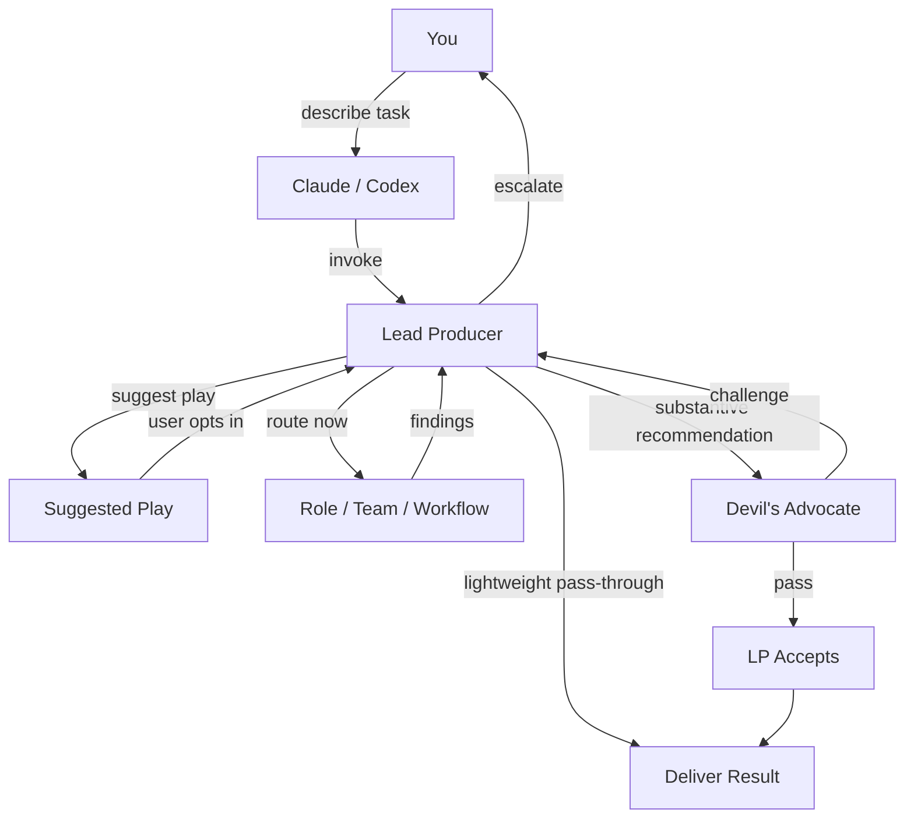

# Lead Producer - Full-Stack AI Product Team

**AI agent work is probabilistic.** Better guardrails, sharper routing, stronger architecture, and
more diverse perspectives on the same problem all increase the odds of a good outcome. Lead
Producer is built to make that reliability practical: one entry point, the right specialists,
explicit stress-testing, and clear recommendations instead of scattered guesses.

This pack models agent work after real software professions because those structures improve
decision quality. Roles, teams, and workflows give agents boundaries, accountability, and multiple
angles on design, frontend, backend, product, QA, smart contracts, deployment, live ops,
iteration, and cleanup.

Complex games that run from conception to live service are one of the hardest environments in
software development. MMO-scale work punishes weak context and bad coordination, whether the team
is human or agentic. That is why this library is tuned to stay lean on context and efficient on
routing so agents can spend more attention on the development itself: economies, progression,
exploits, incidents, rollout risk, and tightly coupled systems. If it can handle that, it becomes
broadly useful across other software work too.

68 total skills: 1 coordinator + 67 specialist skills (41 roles, 12 teams, 14 workflows). Use it
across the full product lifecycle: prototype, design, implementation, testing, deployment, live
ops, iteration, and code cleanup. It includes host guides for **Claude Code** and **OpenAI Codex**
on macOS, Linux, and Windows. Windows is in good shape. macOS and Linux still need a quick real
world check.

---

## Who It's For

- Teams using Claude Code or Codex that want one LP-first entrypoint instead of ad hoc specialist prompting.
- Best fit: complex software products with tightly coupled systems, especially games, marketplaces, economies, live-service, and launch-critical operations.
- Not a product-context pack. It ships generic specialist skills and expects project-specific overlays separately.

---

## What It Looks Like

**Claude Code request**

```text
/lead-producer Review my crafting economy for exploits. Players craft items
from gathered resources and sell on the marketplace.
```

**Codex request**

```text
Use $lead-producer to review my crafting economy for exploits. Players craft
items from gathered resources and sell on the marketplace.
```

**Lead Producer routes to:** Red Team (adversarial) + Economy Team (structural)

**Output**

```text
LEAD PRODUCER REPORT
====================
Route Now: team-red-team, team-economy-team
Suggested Play: none
Route Rationale: Red Team (exploit surface) + Economy Team (faucet/sink balance); no product-specific context loaded

FINDINGS (synthesized):

1. CRITICAL - Infinite craft loop: If crafting output is tradeable AND
   disassembly returns inputs, players can cycle items through alts to
   generate net-positive materials. Exploit requires only 2 accounts.
   Fix: disassembly returns 60-80% of inputs (configurable sink).

2. HIGH - Marketplace price floor bypass: Rare materials have no minimum
   listing price. Attackers can list at 1 currency to manipulate price
   oracles downstream. Fix: enforce floor at crafting-cost basis.

3. MEDIUM - Gathering bot profitability: Resource nodes respawn on fixed
   timers. Bot ROI is positive above 3 nodes/minute. Fix: randomize
   respawn windows +/-30% and add diminishing returns per-account.
```

This is what a coordinated AI skill pack looks like: one prompt, structured analysis, and a
prioritized action plan.

---

## Why This Exists

AI coding assistants are generalists. They will often give you surface-level feedback on economy
design, miss non-obvious exploit chains, and skip the step where their own recommendations get
stress-tested.

This pack replaces "ask an assistant and hope" with a structured review process: domain specialists
analyze the problem, a Devil's Advocate challenges their assumptions, and the Lead Producer
synthesizes everything into an actionable result with evidence standards and severity rankings.
The point is not bigger prompts. It is to make agents behave more like decision systems: surface
evidence, compare trade-offs, state confidence, and make the next step obvious.

It also comes from synthesis, not reinvention. This pack draws inspiration from `superpowers`,
`compilation7`, `gstack`, and Claude Code Game Studios, then adapts those ideas into a coordinated
system for end-to-end MMO and live-service development. It is not a direct fork or bundled
dependency on any of them.

AI-era testing guidance (TDD hazards, AI-generated test quality, evaluator independence) draws from
Anthropic's [Harness Design for Long-Running Application Development](https://www.anthropic.com/engineering/harness-design-long-running-apps)
and Halldór Fannar's [Your Tests Are Still the Real Assets](https://www.linkedin.com/pulse/your-tests-still-real-assets-halldor-fannar/) (Augmented newsletter, March 2026).
Language-specific review expertise (C++, Go, Rust, Python, Kotlin, Java) adapted from
Affaan's [everything-claude-code](https://github.com/affaan-m/everything-claude-code).
Skill authoring, Socratic grilling, session handoff, feedback-loop-first debugging, and the
deletion / deep-module tests draw from [Matt Pocock's skills library](https://github.com/mattpocock/skills).
Godot engine practices draw from [Claude Code Game Studios](https://github.com/donchitos/claude-code-game-studios),
[GodotPrompter](https://github.com/jame581/GodotPrompter), and the community `godot-best-practices` and `gdscript-patterns` skills.

You do not need to know the internal routing. Describe the problem. The Lead Producer figures out
who to call, or whether to suggest a deeper play before routing.

That only works if the pack stays lean. It loads only the roles, teams, and workflows a task
actually needs so the model keeps its context window for the work itself instead of burning it on
unused guidance. Less prompt bloat means better focus and fewer hallucinations from irrelevant
instructions.

---

## Quick Start

### Host Chooser

| Host | Install Step | First Prompt | Manual Success Signal | Next Doc |
|------|--------------|--------------|----------------|----------|
| Claude Code | Link this repo's `.claude` into your project | `/lead-producer Review this onboarding guide for clarity and accuracy.` | First lines include `Route Now: team-documentation` and `Suggested Play: none` | [`.claude/CLAUDE.md`](.claude/CLAUDE.md) |
| OpenAI Codex | Run the installer for your host OS | `Use $lead-producer to investigate why reward claims intermittently fail after reconnect. Find the root cause before fixing.` | First lines include `Route Now: workflow-systematic-debugging` and `Suggested Play: none` | [`.codex/INSTALL.md`](.codex/INSTALL.md) |

### Claude Code

Pick one of the three install paths below.

#### Always available + auto-updating (recommended)

This links every skill into your user-level `~/.claude/skills`, so `/lead-producer` and all
specialists work in **every** Claude Code project — not just one. It also registers a
`SessionStart` hook that pulls the latest pack and reloads skills at the start of each session, so
the install stays up to date on its own.

**macOS / Linux**

```bash
git clone https://github.com/saemihemma/lead-producer-oss.git
cd lead-producer-oss
bash scripts/install-claude.sh
```

**Windows (PowerShell)**

```powershell
git clone https://github.com/saemihemma/lead-producer-oss.git
Set-Location lead-producer-oss
powershell -ExecutionPolicy Bypass -File .\scripts\install-claude.ps1
```

Keep the clone where it is — the skills are symlinked/junction-linked back to it, and the
auto-update hook pulls that clone. Re-running the installer is safe (idempotent). To install the
skills without the auto-update hook, pass `--no-hook` (bash) or `-NoHook` (PowerShell); the
installer backs up `~/.claude/settings.json` to `settings.json.bak` before adding the hook.

#### Claude Code on the web

Web sessions run in ephemeral containers, so install at session start rather than once. In your
[environment's setup script](https://code.claude.com/docs/en/claude-code-on-the-web), clone the
pack and run the installer. A fresh clone each session means it is always current, so the
auto-update hook is unnecessary there:

```bash
git clone --depth 1 https://github.com/saemihemma/lead-producer-oss.git "$HOME/.claude/packs/lead-producer-oss" \
  || git -C "$HOME/.claude/packs/lead-producer-oss" pull --ff-only
bash "$HOME/.claude/packs/lead-producer-oss/scripts/install-claude.sh" --no-hook
```

#### Single project only

Clone the pack once, then link its `.claude` directory into the project where you want to use
`/lead-producer`.

**macOS / Linux**

```bash
git clone https://github.com/saemihemma/lead-producer-oss.git
cd lead-producer-oss
ln -s "$(pwd)/.claude" /path/to/your/project/.claude
```

**Windows (PowerShell)**

```powershell
git clone https://github.com/saemihemma/lead-producer-oss.git
Set-Location lead-producer-oss
New-Item -ItemType Junction -Path 'C:\path\to\your\project\.claude' -Target "$PWD\.claude"
```

If your project already has a `.claude` directory, merge the needed files instead of replacing the
whole folder.

Safe merge recipe for existing `.claude` projects:

- Required: merge this repo's `.claude/skills/` into your project's `.claude/skills/` so `lead-producer` and the shipped specialist skills stay available at their canonical ids.
- Required: keep one project `CLAUDE.md`. Preserve your project-specific rules, then add the Lead Producer host rules and point runtime routing canon at `.claude/skills/lead-producer/SKILL.md`.
- Optional: merge `.claude/settings.json` only if you want this pack's bundled Claude permission defaults. If settings conflict, keep the stricter project value.
- Conflict policy: do not keep two competing route tables or rename the shipped skill folders. Merge host guidance, but let the canonical skills stay canonical.

See [`.claude/CLAUDE.md`](.claude/CLAUDE.md) for Claude host instructions and manual smoke
prompts. Runtime routing canon lives in
[`.claude/skills/lead-producer/SKILL.md`](.claude/skills/lead-producer/SKILL.md).

Start a Claude Code session in your project directory, then use `/lead-producer`.

Manual Claude success signal: first lines include `Route Now: team-documentation` and
`Suggested Play: none` for the host-chooser prompt above.

### OpenAI Codex

```bash
git clone https://github.com/saemihemma/lead-producer.git && cd lead-producer
bash ./scripts/install-codex.sh
```

```powershell
git clone https://github.com/saemihemma/lead-producer.git
Set-Location lead-producer
powershell -ExecutionPolicy Bypass -File .\scripts\install-codex.ps1
```

The PowerShell command uses a process-scoped execution policy bypass. It does not change your
machine-wide PowerShell policy.

Restart Codex, then use `$lead-producer`. Example:

```text
Use $lead-producer to investigate why reward claims intermittently fail after reconnect. Find the root cause before fixing.
```

Manual smoke expectation: first lines include `Route Now: workflow-systematic-debugging` and
`Suggested Play: none`

See [`.codex/INSTALL.md`](.codex/INSTALL.md) for the Codex install details. Codex keeps live links
back to this clone, so keep the repo where you installed it.

---

## Platform Note

- Windows should be ready to use for Claude Code and Codex.
- If you are on macOS or Linux, do one quick sanity pass the first time you install it and flag anything odd.

---

## What's Inside

### 41 Specialist Roles

| Domain | Roles |
|--------|-------|
| Economy and Balance | Economy Designer, Economist, Behavioral Economist, Game Balance Designer |
| Game Design | Game Designer, Narrative Designer, Level & Content Designer |
| Product | Product Manager, Technical Product Manager |
| Engineering | Backend, Frontend, Principal Software, Software Architect, Scalability |
| Engine | Godot Engineer, Unity Engineer |
| Smart Contracts | Move/Sui Developer |
| Security and QA | Security Engineer, QA Engineer |
| Infrastructure | DevOps, Railway Deployment, LiveOps Engineer |
| Data | Analytics Engineer, Data Engineer, Database Engineer |
| Leadership | CTO, Context Manager |
| Brand, Marketing and Community | Brand Strategist, Product Marketing Manager, Community Developer, UI/UX Designer |
| Documentation | Technical Writer, Open Source Engineer, Code Reduction Engineer |
| Language | C++ Engineer, Go Engineer, Rust Engineer, Python Engineer, Kotlin Engineer, Java Engineer, TypeScript Engineer |

Not every role has its own line in Lead Producer's route table. Some roles are routed directly
for single-domain asks; others contribute mainly as members of the review teams below (for
example, the Security Engineer works inside Red Team). Both are first-class — the routing canon
in [`.claude/skills/lead-producer/SKILL.md`](.claude/skills/lead-producer/SKILL.md) decides
which entry point fits the task, so describe the problem rather than picking the specialist.

### 12 Review Teams

| Team | What It Does |
|------|--------------|
| Red Team | Adversarial review - exploits, economic abuse, scalability attacks |
| Dev Team | Code review - correctness, patterns, maintainability |
| Architecture Review | Structural decisions - trade-offs, migration, technical debt |
| Economy Team | Economy health - token flows, inflation, marketplace balance |
| Product Team | Feature evaluation - player value, scope, priority |
| Frontend Team | UI implementation - components, accessibility, performance |
| Move Team | Smart contract review - on-chain safety, gas, upgrade paths |
| Infrastructure | Deployment - CI/CD, monitoring, cost, scaling |
| Brand Team | Brand consistency - voice, visual system, naming |
| Documentation | Docs quality - accuracy, completeness, maintainability |
| Blue Team | Cleanup verification - dead code removal, regression check |
| Open Source | OSS readiness - licensing, contribution guides, API surface |

### 14 Workflows

| Workflow | When To Use |
|----------|-------------|
| Project Discovery | Inherited repos, broad unknowns, or "understand this first" situations |
| Current State Capture | Bounded subsystem orientation, current-reality understanding, and newcomer handoff |
| Specialist Hardening | Repeated 3-reviewer rounds for high-stakes or hard-to-reverse work |
| Pre-Mortem | Assume a hard-to-reverse decision failed; surface failure modes before commit |
| Incident Response | Production is broken. Detect -> triage -> act -> postmortem |
| Systematic Debugging | Unknown bug or failure. Build a feedback loop -> hypothesize -> test -> confirm root cause |
| Issue Triage | Package debugging findings into a durable handoff artifact |
| Requirements Grill | Sharpen a fuzzy request via Socratic interview before specialists start |
| Session Handoff | Compact a session into a durable artifact for the next agent or session |
| Author Skill | Add a new role/team/workflow in pack conventions and wire it into routing and docs |
| Test-Driven Development | Behavior-sensitive changes need disciplined execution |
| Test Strategy | Project-level test suite audit, rearchitecture, and migration planning |
| Design Interface Options | Compare 3 interface approaches side-by-side |
| shadcn/ui Implementation | Component implementation with shadcn/ui patterns |

---

## How It Works



The flow is simple: you describe a task, Lead Producer either routes immediately or recommends a
suggested play first. If LP routes now, the selected specialists send findings back to LP for
synthesis. LP can deliver lightweight pass-through results directly, but substantive
recommendations go through Devil's Advocate before acceptance. If LP suggests a play, you opt in
and LP then routes there. If the team cannot resolve a disagreement, Lead Producer escalates with
both positions documented.

## LP-First Suggested Plays

Lead Producer is still the only documented entrypoint. When a task needs understanding before
judgment, LP can recommend a deeper workflow without auto-running it:

- `Suggested Play: workflow-project-discovery` for inherited repos, broad unknowns, or discovery-first work
- `Suggested Play: workflow-current-state-capture` for bounded "what exists now" understanding before you change something
- `Suggested Play: workflow-premortem` for high-stakes, irreversible, or high-blast-radius decisions you want failure-tested before commit
- `Suggested Play: workflow-requirements-grill` for fuzzy requests you want sharpened — a Socratic interview that walks the open decisions one at a time before any specialist starts

A suggested play is a recommendation, not an automatic route. If you want it, reply to LP with
"use the project discovery play" or "help me understand the current state of this system," and LP
will route there immediately.

Legacy note: older "reverse documentation" phrasing still routes through LP to current-state
capture for compatibility.

Project discovery is repo-wide. Current-state capture is bounded to one system, flow, or artifact
cluster.

## Specialist Hardening

When the stakes are high or you explicitly want deeper pressure, LP can route directly to
`workflow-specialist-hardening`. That workflow runs 3 contextualized reviewer slots per round and
keeps going until the work clears the quality bar, needs a real user decision, or stops improving.
Use it after discovery or current-state capture when understanding exists and the remaining problem
is quality.

## Pre-Mortem

Every substantive recommendation already gets a lightweight pre-mortem inside the Devil's Advocate
pass: assume it failed, narrate why, convert each cause into a check. For a hard-to-reverse,
launch-critical, or high-blast-radius decision, LP can suggest `workflow-premortem` — a deeper pass
that imagines the decision has already failed, ranks the failure stories by likelihood and impact,
and attaches a leading indicator, mitigation, and owner to each before you commit. Pre-mortem is
prospective ("assume failure, reason backward"); Devil's Advocate is reactive critique of the plan
in front of you. Reply to LP with "run a pre-mortem" to opt in.

## Sharpen, Hand Off, and Extend

Three workflow skills support the work around the work:

- **`workflow-requirements-grill`** — when a request is fuzzy, LP can interview you Socratically, walking the open decisions one at a time and recommending an answer for each, until the work is specified well enough to route. Grilling sharpens the plan; the pre-mortem then stress-tests it.
- **`workflow-session-handoff`** — at the end of a long session, produces a durable `_artifacts/handoff-<slug>.md` so the next session or agent can resume cold: what was done, what is open, next steps, and which skills to use. (Use `role-context-manager` to keep a session going; use handoff to stop cleanly.)
- **`workflow-author-skill`** — adds a new role, team, or workflow in pack conventions and wires it into routing, counts, smoke tests, and docs in one pass, so the pack stays consistent as it grows.

Skills carry an optional `status` frontmatter field (`draft` or `deprecated`); LP will not route to either. Active skills carry no `status` field.

## Frontend Companion Tooling

For frontend-heavy work, strongly prefer Playwright or an equivalent real-browser loop when the
question depends on interaction bugs, responsive behavior, accessibility, browser state, or
network and error handling. This repo does not bundle Playwright; treat it as a companion tool
that makes frontend review and debugging more trustworthy.

---

## More Examples

Every prompt below works in Claude Code as `/lead-producer <prompt>` and in Codex as
`Use $lead-producer to <prompt>`. The canonical smoke-test list (with expected first lines)
lives in [`.claude/CLAUDE.md`](.claude/CLAUDE.md); these illustrate the routing range.

| Ask | Expected route |
|-----|----------------|
| Respond to a production incident: players can't mint. | `Route Now: workflow-incident-response` |
| Can we add PvP loot drops without breaking the economy? | `Route Now: team-economy-team` |
| Design three options for guild management UI. | `Route Now: workflow-design-interface-options` |
| Investigate why reward claims intermittently fail after reconnect. Find the root cause before fixing. | `Route Now: workflow-systematic-debugging` |
| Package this debugging result into a handoff artifact for the next engineer. | `Route Now: workflow-issue-triage` |
| Help me understand the current state of the reward claim flow before we change it. | `Route Now: workflow-current-state-capture` |
| This codebase is inherited and messy — should we spike or do discovery first? | `Suggested Play: workflow-project-discovery` |
| This payout rollback plan is high stakes. Run the specialist hardening play and repeat until 9. | `Route Now: workflow-specialist-hardening` |

---

## Context Overlays

This is a generic specialist pack with zero product-specific knowledge. It is tuned on game and
live-service failure modes, but the routing model is useful across broader software work too.

If your game needs project-specific context, create a separate context module pack and map it to
the generic roles through a coordinator. The Lead Producer can then load those modules only when
they are explicitly named or routed in.

---

## Architecture

```text
lead-producer/
|-- .claude/
|   |-- CLAUDE.md                     # Claude Code host guidance
|   |-- settings.json                 # Claude Code permissions
|   `-- skills/                       # canonical skill content
|       |-- lead-producer/SKILL.md
|       |-- role-economist/SKILL.md
|       |-- team-red-team/SKILL.md
|       `-- ...
|-- .codex/
|   `-- INSTALL.md                    # Codex host guide
|-- .github/
|   `-- workflows/validate.yml        # CI: runs the pack validator
|-- scripts/
|   |-- install-claude.sh             # macOS/Linux Claude Code installer (user-level + auto-update)
|   |-- install-claude.ps1            # Windows Claude Code installer (user-level + auto-update)
|   |-- lp-session-update.sh          # SessionStart auto-update hook (macOS/Linux/web)
|   |-- lp-session-update.ps1         # SessionStart auto-update hook (Windows)
|   |-- install-codex.sh              # macOS/Linux Codex installer
|   |-- install-codex.ps1             # Windows Codex installer
|   `-- validate-skills.py            # pack consistency validator
|-- whenupdating.md                   # maintenance checklist
|-- README.md
|-- LICENSE
`-- .gitignore
```

`.claude/skills/` is the canonical skill content. Claude Code reads it through the linked
`.claude` directory. Codex links the skill folders into `$CODEX_HOME/skills`.

`.claude/skills/lead-producer/SKILL.md` is the routing canon. Public docs and host guides should
describe it faithfully, but runtime routing semantics live there first.

`CLAUDE.md` is Claude Code host guidance. Runtime-critical routing and evidence rules belong in
skill files so Claude Code and Codex consume the same skill contract.

---

## Customization

**Add a role:** Create `.claude/skills/role-your-role/SKILL.md` with:

```yaml
---
name: role-your-role
description: "What this role does in one line"
---
```

Then update `.claude/skills/lead-producer/SKILL.md` with any runtime-facing routing change.
Mirror that change in `.claude/CLAUDE.md` only when the Claude host guidance also needs it.
Inside this pack, `workflow-author-skill` does all of that wiring in one pass. Either way, finish
with `python3 scripts/validate-skills.py` — CI runs the same check on every push.

**Add a team:** Same structure, plus `context: fork` in frontmatter. Add `effort: high` if the
team has 5+ members or handles a high-risk domain.

**Create a context overlay:** Create a separate pack with its own coordinator that maps the overlay
modules to the generic roles in this pack.

---

## License

MIT License. See [LICENSE](LICENSE) for details.
